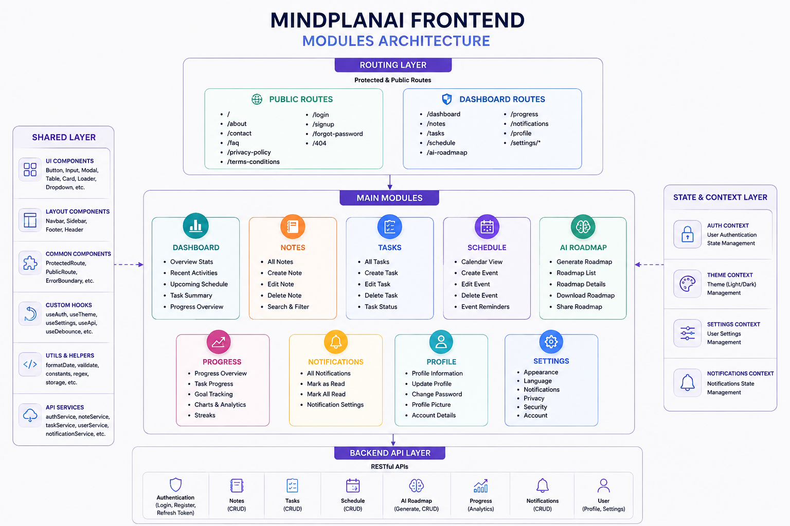

# 🧠 MindPlanAI Frontend

> **Organize. Learn. Achieve.**

MindPlanAI is a modern AI-powered productivity platform built with **React.js**. 
It provides users with an intuitive workspace to manage notes, tasks, schedules, 
AI-generated learning roadmaps, progress tracking, and profile management through a clean and responsive dashboard.

---

# 📖 Overview

The frontend focuses on delivering a professional user experience with reusable UI components, responsive layouts, and clean project organization. It has been designed to integrate seamlessly with a Node.js backend and MySQL database.

The application follows component-based architecture, CSS Modules for styling, and a scalable folder structure to simplify future development.

---

# 🚀 Features

## Public Pages

- Home
- About
- Login
- Sign Up
- Forgot Password
- 404 Page

---

## Dashboard

- Dashboard Overview
- Notes Management
- Tasks Management
- Schedule Management
- AI Roadmap Generator
- Progress Tracking
- Notifications
- User Profile
- Settings

---

## Settings

- Appearance
- Language
- Notification Preferences
- Privacy Settings
- Security Settings
- Account Settings

---

# 🎨 UI Features

- Modern Dashboard
- Responsive Layout
- Reusable Components
- CSS Modules
- Modular Folder Structure
- Clean Typography
- Consistent Color Palette
- Professional Card Design
- Interactive Forms
- Responsive Navigation
- Mobile Friendly Design

---

# 🏗 Project Structure

```text
src/
│
├── app/
│
├── assets/
│
├── components/
│   ├── ui/
│   ├── layout/
│   └── common/
│
├── pages/
│   ├── public/
│   ├── auth/
│   └── dashboard/
│
├── scripts/
│   └── Contents/
│
├── routes/
│
├── hooks/
│
├── context/
│
├── services/
│
├── utils/
│
└── styles/
```

---

# 🛠 Technology Stack

### Frontend

- React.js
- React Router DOM
- JavaScript (ES6+)
- CSS Modules

---

# 📱 Responsive Design

The application is optimized for:

- Mobile
- Tablet
- Laptop
- Desktop
- Large Screens

---

# 📦 Installation

Clone the repository
```bash
git clone https://github.com/Malaika-programmer/cohort-9-mern-6807-malaika.git
```

Navigate to the project

cd front-end

Install dependencies
```bash
npm install
```

Start development server

```bash
npm run dev
```

---

# 📂 Available Scripts

Run development server

```bash
npm run dev
```

Build production application

```bash
npm run build
```

---

# 🏛 Architecture

The project follows a modular architecture with reusable UI components.

<p align="center">
  
</p>


This architecture makes the application scalable, maintainable, and easy to extend.

---

# 🔐 Authentication Flow

The frontend includes complete authentication interfaces for:

- Login
- Registration
- Forgot Password


---

# 📋 Dashboard Modules

- Dashboard
- Notes
- Tasks
- Schedule
- AI Roadmaps
- Progress
- Notifications
- Profile
- Settings

---


# 👩‍💻 Author

**Malaika Azam**

Software Engineering Student

Frontend Developer • MERN Stack Developer • AI Enthusiast

---

## ⭐ Project Status

**Frontend:** ✅ Completed

**Backend:** 🚧 In Progress

**Database:** 🚧 Planned

**Authentication:** 🚧 Planned

**Testing:** 🚧 Planned

**Deployment:** 🚧 Planned